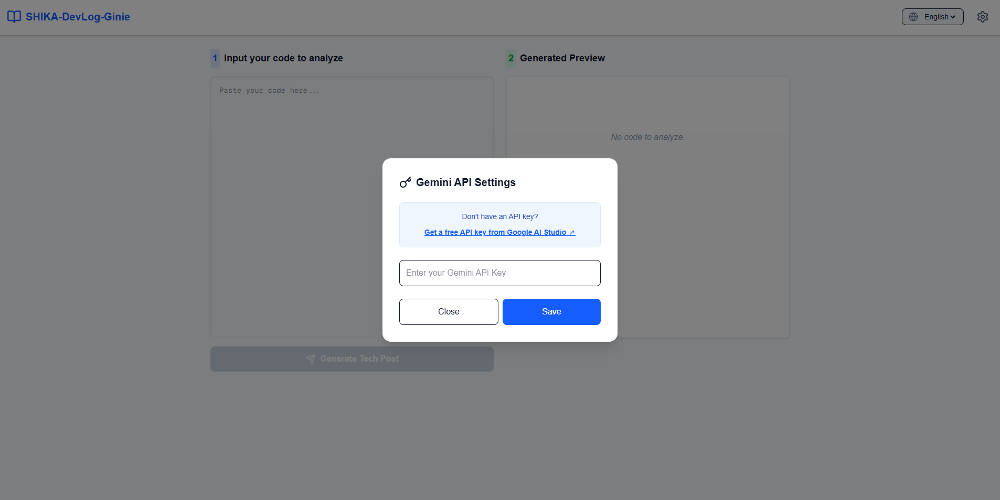
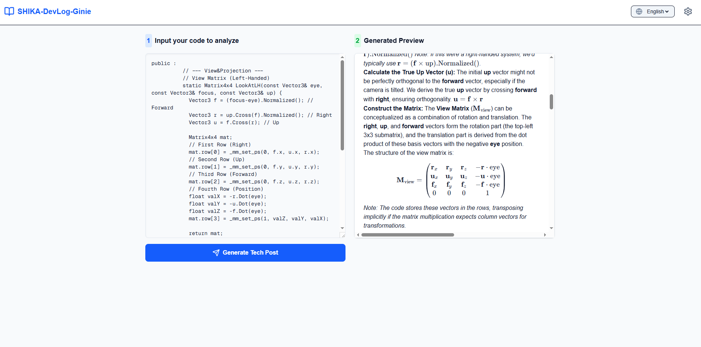

<div align="center">

# 🦌 SHIKA-DevLog-Ginie


[](https://shika-dev-log-genie.vercel.app/)
[](https://deepmind.google/technologies/gemini/)


> **Turning your raw code into professional, Notion-style technical blog posts in seconds.**

<br>

<a href="https://shika-dev-log-genie.vercel.app/">
  <p align="center">
    
    
  </p>
</a>

*Left: Easy API Setup | Right: Beautifully Rendered Result*

</div>

---

## ✨ Key Features

- **AI Code Analysis**: Uses **Gemini 2.5 Flash** to deeply understand and explain your logic.
- **Multilingual Support**: Generate posts in **English, 한국어, or 日本語**.
- **Notion-Ready**: Perfectly formatted with Markdown and beautiful **LaTeX ($$...$$)** math equations.
- **Privacy First (BYOK)**: Your API key is stored only in your browser's local storage. We never save your keys.
- **Live Preview**: See your rendered blog post in real-time.

---

## 🚀 How to Use

1. **Get API Key**: Obtain your free Gemini API key from [Google AI Studio](https://aistudio.google.com/).
2. **Setup**: Click the ⚙️ icon in the app and paste your key.
3. **Input**: Paste your code or technical logic in the left panel.
4. **Generate**: Click "Generate Tech Post" and watch the magic happen!
5. **Copy**: Copy the rendered result and paste it directly into your **Notion** or **Tech Blog**.

---

## 🛠 Tech Stack 

| Category | Technology |
| :--- | :--- |
| **Framework** | Next.js 15+ (App Router) |
| **AI Model** | Google Gemini 2.5 Flash |
| **Styling** | Tailwind CSS |
| **Icons** | Lucide React |
| **Rendering** | React Markdown, KaTeX (for Math) |

---

## 📦 Local Setup 

```bash
# Clone the repository
git clone [https://github.com/SHIKA-gfx/SHIKA-DevLog-Genie.git](https://github.com/SHIKA-gfx/SHIKA-DevLog-Genie.git)

# Install dependencies
npm install

# Run the development server
npm run dev